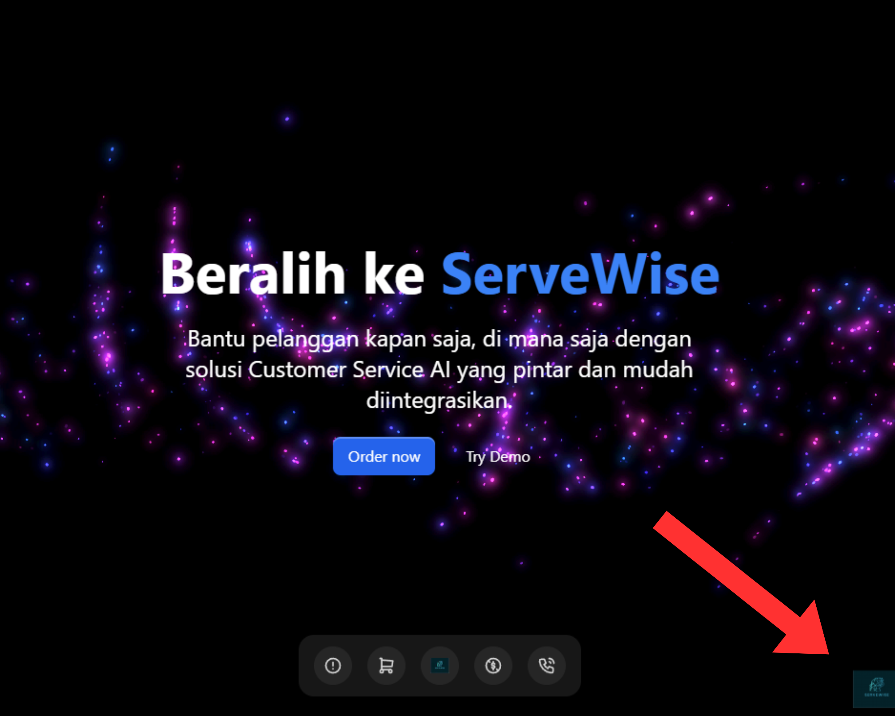

# ServeWise - Lomba Festival Teknik Informatika Darussalam

ServeWise adalah website yang dikembangkan untuk mengikuti kompetisi Lomba Festival Teknik Informatika Darussalam, bertujuan untuk menggali potensi digital dengan konsep inovatif dan kreatif. Dalam era teknologi yang terus berkembang, ServeWise diharapkan menjadi solusi digital yang tidak hanya menarik secara visual tetapi juga memberikan dampak positif bagi pengguna. Dengan antarmuka yang intuitif dan fungsionalitas yang canggih, website ini dirancang untuk melayani kebutuhan pengguna secara efektif.

Website ini mengusung nilai utama dalam menciptakan interaksi yang ramah pengguna dengan tata letak yang responsif dan estetika modern yang mendukung tema lomba.

🌐 **[Visit Our Website](https://servewise.bimadev.xyz)**

## 📌 Purpose
Di **ServeWise**, tujuan utama kami adalah membantu individu dan bisnis memanfaatkan kekuatan teknologi untuk mencapai tujuan mereka. Kami menyediakan solusi komprehensif untuk membangun situs web, aplikasi, dan produk digital lainnya yang efektif dan efisien.

## 🚀 Vision
Menjadi kekuatan terdepan dalam inovasi digital, menawarkan solusi mutakhir dan menjadi mitra tepercaya dalam perjalanan transformasi digital bagi individu dan perusahaan di seluruh dunia.

## 🎯 Mission
- **Memberikan solusi digital inovatif** yang memenuhi kebutuhan spesifik setiap klien.
- **Mengutamakan kualitas dan efisiensi** dalam setiap proyek untuk memastikan hasil terbaik.
- **Memanfaatkan teknologi terkini** untuk menawarkan layanan yang terukur dan aman.
- **Membangun hubungan jangka panjang dengan klien kami**, menyediakan dukungan dan keahlian berkelanjutan.
- **Menciptakan platform digital berkelanjutan** dengan kinerja optimal dan pengalaman pengguna yang lancar.

## ✨ Features
- **Responsive Web Design**: Website yang kami buat dioptimalkan sepenuhnya untuk semua perangkat.
- **Clean and Structured Code**: Kami memastikan bahwa kode kami efisien, mudah dipelihara, dan mengikuti praktik terbaik di industri ini.
- **Interactive User Experience**: Layanan kami berfokus pada penciptaan pengalaman yang intuitif dan menarik bagi pengguna.
- **Fast and Secure**: Kami mengutamakan kinerja dan keamanan dalam setiap proyek.

## 🛠️ Technologies We Use
- **Frontend**: HTML5, TailwindCSS, Typescript, React
- **Framework**: Next.js, VectorShift
- **UI Component** : Aceternity UI
- **Version Control**: Git, GitHub
- **Hosting**: Vercel

## 📈 Future Goals
Kami terus berupaya memperluas layanan dan mengintegrasikan teknologi baru, termasuk solusi berbasis AI dan infrastruktur cloud yang ditingkatkan. Nantikan informasi terbaru yang menarik!

## 🤝 Get In Touch
Interested in working with us? Want to know more about our projects? Feel free to reach out!

- **Email**: [bimaj0206@gmail.com](mailto:bimaj0206@gmail.com)
- **Website**: [https://servewise.bimadev.xyz](https://servewise.bimadev.xyz)

## 📄 License
This project is licensed under the MIT License - see the [LICENSE](LICENSE) file for details.

---

**ServeWise** - Smart Solutions for a Smarter Future 🌟
